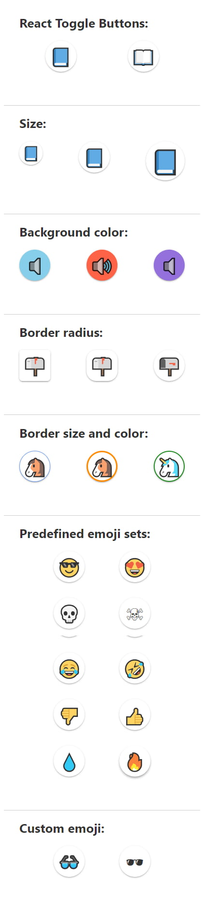

# react-toggle-emoji

A small library of react toggle button components that use emoji to express their state.

## Live demo:

[https://react-toggle-emoji.netlify.com](https://react-toggle-emoji.netlify.com/)

---

## Social Links

- [www.georgi-yanev.com](https://www.georgi-yanev.com)
- [blog.georgi-yanev.com](https://blog.georgi-yanev.com)
- [Facebook](https://www.facebook.com/jumpalottahigh/)
- [Twitter](https://www.twitter.com/jumpalottahigh/)
- [LinkedIn](https://www.linkedin.com/in/yanevgeorgi/)
